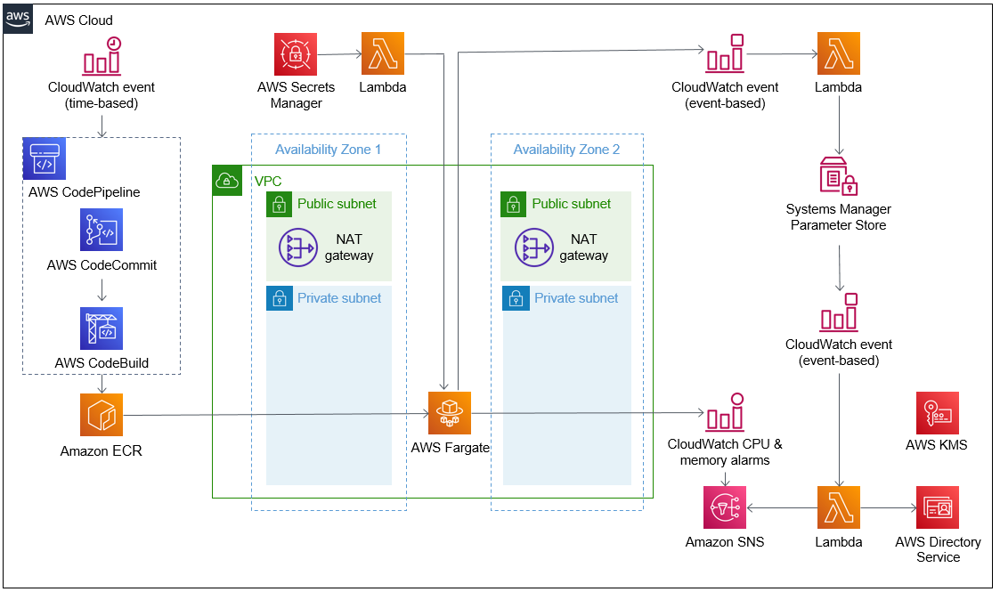

Deploying this Quick Start for a new virtual private cloud (VPC) with
default parameters builds the following {partner-product-short-name} environment in the AWS Cloud.

:xrefstyle: short
[#architecture1]
.Quick Start architecture for {partner-product-short-name} on AWS

As shown in <<architecture1>>, the Quick Start sets up the following:

* A highly available architecture that spans two Availability Zones.*
* A VPC configured with public and private subnets, according to AWS
best practices, to provide you with your own virtual network on AWS.*
* In the public subnets:
** Managed network address translation (NAT) gateways to allow outbound
internet access for resources in the private subnets.*
* In the private subnets:
** Fargate containers for Duo Authentication Proxy in an Auto Scaling group to allow for scaling workloads up or down, as determined by Amazon CloudWatch CPU and memory alarms. 
* In the CI/CD pipeline:
** AWS CodePipeline to start a pipeline as initiated by a CloudWatch time-based event. CodePipeline retrieves a container from AWS CodeCommit, builds the container with AWS CodeBuild, and pushes the image to Amazon Elastic Container Registry (Amazon ECR). A CloudWatch scheduled-event trigger rebuilds the ECR image and scans the newly built container.
* AWS Secrets Manager to rotate secrets regularly. 
* A Lambda function to replace the Fargate containers when secrets are rotated.
* AWS Key Management Service (AWS KMS) to [do what? ____].
* An AWS Directory Service managed directory to store the updated the IP addresses of Fargate containers when the containers are stabilized. 
* A CloudWatch event-based event to [do what? ____ Describe the second one] 
* A Lambda function to [do what? ____ Describe the second one]
* AWS Systems Manager Parameter Store to store Fargate container IP addresses. 
* A CloudWatch event-based event to [do what? ____ Describe the third one] 
* A Lambda function to [do what? ____ Describe the third one]
* Simple Notification Service (Amazon SNS) to notify the administrator when the Fargate containers scale, when a new container is built, or when a container build fails.

[.small]#*The template that deploys the Quick Start into an existing VPC skips the components marked by asterisks and prompts you for your existing VPC configuration.#

//TODO Dave, I've streamlined the architecture diagram and reorganized the bullets to follow the arrows. It's incomplete and incorrect in places. Please fix what's wrong and fill in what's missing.