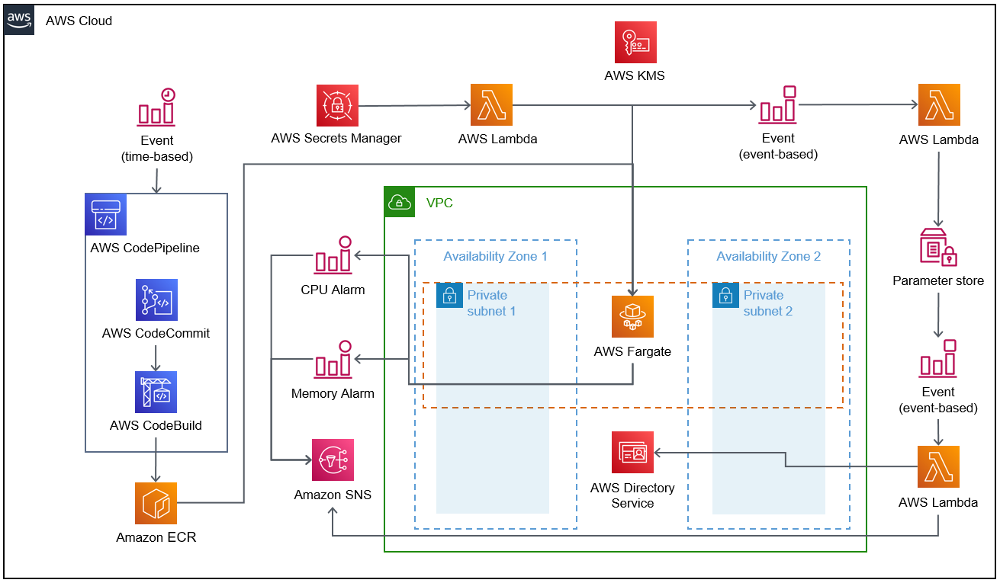

Deploying this Quick Start for a new virtual private cloud (VPC) with
default parameters builds the following {partner-product-short-name} environment in the
AWS Cloud.

// Replace this example diagram with your own. Send us your source PowerPoint file. Be sure to follow our guidelines here : http://(we should include these points on our contributors giude)
:xrefstyle: short
[#architecture1]
.Quick Start architecture for {partner-product-short-name} on AWS

As shown in <<architecture1>>, the Quick Start sets up the following:

* A highly available architecture that spans two Availability Zones.*
* A VPC configured with public and private subnets, according to AWS
best practices, to provide you with your own virtual network on AWS.*
* In the public subnets:
** Managed network address translation (NAT) gateways to allow outbound
internet access for resources in the private subnets.*
* In the private subnets:
** Fargate containers for Duo Authentication Proxy with autoscaling to allow for scaling of workloads.
*** CloudWatch CPU and memory alarms are used to determine when to scale up or down.
* An AWS Directory Service managed directory.*
* A scheduled event trigger rebuilds the ECR image and scans the newly built container.
** Trigger starts a CodePipeline.
** CodePipeline retrieves the container from CodeCommit, builds the container with CodeBuild, and pushes the image to ECR.
* Secrets Manager is used to rotate secrets regularly. 
** When secrets are rotated a Lambda function replaces the Fargate containers
** Fargate containers, when stabilized, update their IP addresses in AWS Directory Service.
*** Fargate container IP addresses are stored in Systems Manager Parameter Store
* SNS notifications notify the administrator when the Fargate containers scale or, a new container is built, or a container build fails.

[.small]#*The template that deploys the Quick Start into an existing VPC skips the components marked by asterisks and prompts you for your existing VPC configuration.#
