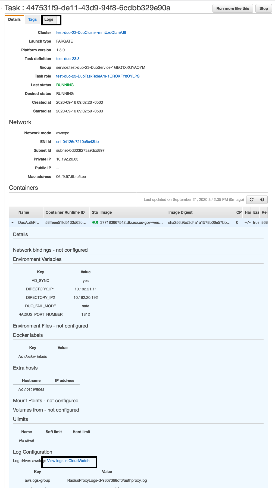

// We need to work around Step numbers here if we are going to potentially exclude the AMI subscription
=== Confirm your AWS account configuration

. Sign in to your AWS account at https://aws.amazon.com with an IAM user role that has the necessary permissions. For details, see link:#_planning_the_deployment[Planning the deployment] earlier in this guide.
. Make sure that your AWS account is configured correctly, as discussed in the link:#_technical_requirements[Technical requirements] section.

// Optional based on Marketplace listing. Not to be edited
ifdef::marketplace_subscription[]
=== Subscribe to the {partner-product-short-name} AMI

This Quick Start requires a subscription to the AMI for {partner-product-short-name} in AWS Marketplace.

. Sign in to your AWS account.
. Open the page for the {marketplace_listing_url}[{partner-product-short-name} AMI in AWS Marketplace^], and then choose *Continue to Subscribe*.
. Review the terms and conditions for software usage, and then choose *Accept Terms*. +
  A confirmation page loads, and an email confirmation is sent to the account owner. For detailed subscription instructions, see the https://aws.amazon.com/marketplace/help/200799470[AWS Marketplace documentation^].

. When the subscription process is complete, exit out of AWS Marketplace without further action. *Do not* provision the software from AWS Marketplace—the Quick Start deploys the AMI for you.
endif::marketplace_subscription[]
// \Not to be edited

=== Launch the Quick Start
// Adapt the following warning to your Quick Start.
WARNING: If you’re deploying {partner-product-short-name} into an existing VPC, make sure that your VPC has two private subnets in different Availability Zones for the workload instances and that the subnets aren’t shared. This Quick Start doesn’t support https://docs.aws.amazon.com/vpc/latest/userguide/vpc-sharing.html[shared subnets^]. These subnets require https://docs.aws.amazon.com/vpc/latest/userguide/vpc-nat-gateway.html[NAT gateways^] in their route tables to allow the instances to download packages and software without exposing them to the internet. Also make sure that the domain name option in the DHCP options is configured as explained in http://docs.aws.amazon.com/AmazonVPC/latest/UserGuide/VPC_DHCP_Options.html[DHCP options sets^]. You provide your VPC settings when you launch the Quick Start.

NOTE: You are responsible for the cost of the AWS services used while running this Quick Start reference deployment. There is no additional cost for using this Quick Start. For full details, see the pricing pages for each AWS service used by this Quick Start. Prices are subject to change.

Each deployment takes about {deployment_time} to complete.

. Obtain the license for deploying {partner-product-short-name} 
To get these Duo account settings:

    * Log in to Duo with your Duo account, or sign up for an account (https://signup.duo.com/) if you don’t already have one. For more account information, see the Technical requirements and Cost and Licenses sections of this guide.
    * If Directory Sync is required:
    ** Setup Directory sync per the steps in https://duo.com/docs/adsync.
    ** Obtain the *Integration Key, Secret Key, and API Hostname* from the directory setup. These will be used for template parameter values.
    *** Log into the Duo Admin Panel (https://admin.duosecurity.com/), and then navigate to *Users*
    *** Choose *Directory Sync*, and then *New Directory*.
    *** Choose *On-Premises Active Directory* (even if Amazon Managed AD)
    *** Input a Directory Name (needed to ID it in Duo), Input the Host IPs and port (you will put the other IP and port for 2nd DC later).
    *** Choose NTLMv2 for Authentication Type
    *** Input the Base DN per the instructions.
    *** Check any of the other settings as you wish, and Click *Add Directory.*
    *** Once the screen refreshes, scroll to the bottom and you will see the section that contains the *Integration Key, Secret Key, and API Hostname.*
    *** Leave this screen open or write down the needed items, and continue to step 12, you will need the three items mentioned above for the template input.

 

[start=2]
. Sign in to your AWS account, and choose one of the following options to launch the AWS CloudFormation template. For help with choosing an option, see link:#_deployment_options[Deployment options] earlier in this guide.

[cols=2*]
|===
^|http://qs_launch_permalink[Deploy {partner-product-short-name} into a new VPC on AWS^]
^|http://qs_template_permalink[View template^]

^|http://qs_launch_permalink[Deploy {partner-product-short-name} into an existing VPC on AWS^]
^|http://qs_template_permalink[View template^]
|===

[start=3]
. Check the AWS Region that’s displayed in the upper-right corner of the navigation bar, and change it if necessary. This Region is where the network infrastructure for {partner-product-short-name} is built. The template is launched in the {default_deployment_region} Region by default.

// *Note:* This deployment includes Amazon EFS, which isn’t currently supported in all AWS Regions. For a current list of supported Regions, see the https://docs.aws.amazon.com/general/latest/gr/elasticfilesystem.html[endpoints and quotas webpage].
[start=4]
// . Update Directory Controller Security Group

//     * Ensure the existing security group associated with your domain controllers allow User Datagram Protocol (UDP) port 1812 (by default or specify the port) egress (Outbound) to their own subnet CIDR range (or the entire VPC).

// . Upload Duo Zip File to S3

//     * Either create a new S3 bucket or use an existing CloudFormation template bucket.
//     * Unzip the delivered Duo zip file, and upload the quickstart-duo-mfa folder to the S3 bucket.
//     * Make note of the S3 bucket name and folder prefix, this will be used in the parameters of the CloudFormation template below.

. On the *Create stack* page, keep the default setting for the template URL, and then choose *Next*.
. On the *Specify stack details* page, change the stack name if needed. Review the parameters for the template. Provide values for the parameters that require input. For all other parameters, review the default settings and customize them as necessary. For details on each parameter, see the link:#_parameter_reference[Parameter reference] section of this guide. When you finish reviewing and customizing the parameters, choose *Next*.
. After you successfully launch the stack, follow these steps as the ECS containers are starting up:

    * Validate that the ECS Service starts up the number of instances that you specified in the parameters (default of two).
    * Navigate to the Amazon ECS console, and look for *ECS Cluster* under which you will see the *ECS service*. Under the service you should see 2 tasks and they should have a status of *Pending* or *Running*.

:xrefstyle: short
[#ecs_task_cloudwatch_logs]
.ECS Task CloudWatch Logs

    * Click on one of the tasks and open the container tab to see the logs in CloudWatch. You can either click on the top tab or under the container tab to see the CloudWatch logs as shown in <<ecs_task_cloudwatch_logs>>.

    * Navigate to the Directory Service console, and select your directory.
    * Choose the *Networking & security* tab.
    * In the *Multi-factor authentication* pane at the bottom of the page, the RADIUS status should be *Completed* (it can take a few minutes for Systems Manager to register and configure the instances). If the status is *Failed*, see Troubleshooting MFA implementation, later in this guide. To view the MFA configuration, choose the *Actions* dropdown option in the *Multi-factor authentication* pane, and then choose *Edit*. You will see the IP addresses of the RADIUS instances created by the Auto Scaling group. The shared secret code values are empty for security reasons.
    * Open the Amazon WorkSpaces Client.
    * When it opens, ensure you are using the Registration code from your Registered ADC that you used for the Duo setup above. 
    * Once it loads to the screen to input your username and password, you should see a third text box for the MFA Code. Here you will need to enter the code from the mobile app, or the hardware security token mentioned prior.

[start=7]
. Sync Users to Duo Cloud and add hardware token (optional). This step is only valid if AD sync was chosen, otherwise this step can be ignored.

    * Once you have validated that everything is working, go back to the Duo Admin site.
    * Either go back to the screen you left open for Add New Directory or click on *Users* on the left hand side of screen, then click on *Directory Sync* near the top right.
    * You will need to input the NTLM domain (the Active Directory domain).
    * You will need to input the NTLM workstation (the hostname of one of the Duo Radius ECS ip addresses) (example: 10.0.10.10, 10.0.11.10).
    * Click *refresh* at the bottom of the page, this should bring you to the top of the page which will instruct to select a group to import.
    * At the bottom of the page, select the *Groups* input field, and type out the AD group with the users you want to have imported into Duo. 
    * Click *Save Groups*.
    * At the top of the page, you should now be able to select *Sync Now*.
    * Now that you have users synced, click on the *Users* link on the left side of the screen.
    * You should now see the list of users that were imported from your AD Group.
    * If you click on a user, you will see details about the user that were imported from AD as well as additional Duo-specific details. You are able to change the user toggle the user status between Active and Bypass to determine whether they require MFA for login.
    * You can add a user's phone numebr to allow them to use the Duo Mobile application, and you can add a Hardware Tokens. 
    ** To add a hardware token, click on the *Add Hardware Token* button.
    ** On the Attach Hardware Token screen, you can start to type the serial number of one of the tokens that you ordered and then click on *Attach Hardware Token*.

=== Modifying the implementation

If you want to increase or decrease the number of RADIUS tasks after implementing the solution, update the CloudFormation stack and specify the desired number of servers. 
If you increase the number of tasks, the ECS Service starts up the number of new tasks, and installs and configures the Duo Authentication Proxy for each new task. 

:xrefstyle: short
[#duo_ecs_service_stable]
.ECS service stable
image::../images/duo_ecs_service_stable.png[Architecture,width=100%,height=100%]

After each task is configured, the ECS service sends an event saying the service has reached a steady state as shown in <<duo_ecs_service_stable>>.
 
That message acts as an event in CloudWatch which triggers a Lambda function to process the event. This event finds the IP address of Fargate task and updates the SSM parameter DuoServiceIps which triggers another event and updates the Directory Service MFA. The whole process takes 2-3 minutes.
 
Application Autoscaling in the ECS service automatically scales the ECS tasks when CPU or memory limits are reached. This allows for handling spikes in traffic, such as early morning logins. Likewise, when the ECS service does not see a lot of activity Application Autoscaling decreases the number of tasks, and then triggers the preceding workflow to get IP addresses from Lambda functions and update the Directory Service RADIUS configuration.

It is recommended to stand up a regular trigger on a pipeline to get the latest code and build it. By default, the trigger frequency is set to weekly, which can be changed with a CloudFormation parameter during stack creation or update. When the secrets are rotated the newest image is automatically pulled and deployed. ECR is configured to scan on push and builds can wait to see the results of the scan. If the build or scan fails then Duo administrators are notified.